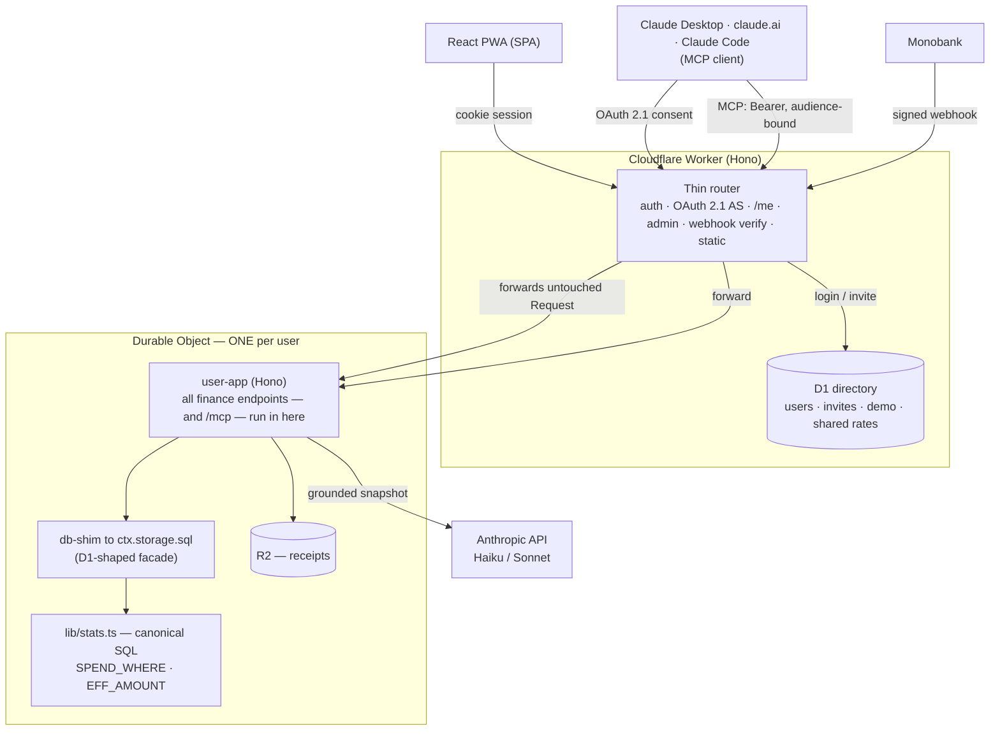

# Money Track

A personal finance tracker built as a **portfolio project** — with heavy use of AI, and a lot of
deliberate effort spent making sure the AI never got to lie about the numbers.

It connects to a Ukrainian bank (Monobank) or a CSV export, categorizes every transaction with a
deterministic-first pipeline, and layers an AI financial advisor on top that reasons over the
**same canonical numbers** the UI shows — never its own.

It also exposes your own ledger to **Claude as an MCP server** — the app is both the MCP resource
server and its own OAuth 2.1 authorization server, so connecting Claude Desktop, claude.ai or the
mobile app is a URL and a consent screen, with nothing to paste and nothing stored on your disk.

> **Try it:** [`/demo`](https://money.italik.dev/demo) — spins up a private,
> throwaway sandbox seeded with ~6 months of realistic data. No sign-up, resets in 24 hours.


<table>
<tr>
<td width="50%"></td>
<td width="50%"></td>
</tr>
<tr>
<td></td>
<td></td>
</tr>
</table>

<sup>Screenshots are from the live demo — the same seeded dataset anyone gets at `/demo`.</sup>

---

## What it does

- **Bank sync** — Monobank webhook + ~90-day backfill, or a CSV statement import. A `BankProvider`
  abstraction normalizes sign/currency/minor-units in exactly one place per bank.
- **Deterministic categorization** (AI is the *last* resort): learned merchant alias → active
  subscription match → merchant consensus → MCC/text rules → AI enrichment.
- **Analytics** that are correct by construction: multi-currency roll-up into whichever base
  currency the reader picked, sub-category roll-up, splits, refunds, reimbursements, transfers
  between your own accounts, cash reclassified by real category — all funneled through one
  canonical SQL layer.
- **AI advisor & chat** with tool-use (queries the full transaction history), weekly/monthly
  reports, a proactive notification feed, and a fact layer ("the metro fare went 8 → 30 ₴") that
  can adjust the forecast — but only after you confirm it.
- **Budgets, goals, event/trip budgets, net-worth history, a financial-health index**, subscription
  price-drift detection, a command palette (⌘K), and a bilingual UI (English / Ukrainian).
- **An MCP server over your own data** — connect Claude and ask it about your finances directly.
  Read-only, revocable, and it answers from the same canonical figures the screens do. See
  [below](#your-ledger-as-an-mcp-server).
- **Telegram bot + Mini App** — balance, last operations and budgets in chat; the Mini App is a
  second key into an existing account (it can never create one).
- **Multi-user & isolated** — every user's entire database lives in their own Durable Object.
- Installable **PWA**.

---

## Architecture

The whole app is one Cloudflare Worker. The interesting decision is **isolation via a Durable
Object per user** instead of `user_id` columns.



**Why a Durable Object per user (not `WHERE user_id`)?** Row-level multi-tenancy would mean adding
a filter to every one of dozens of canonical queries — and one forgotten filter leaks another
person's money. With a DO per user the isolation is *physical*: there is no `user_id` to forget,
and `lib/stats.ts` stays byte-for-byte the same as the single-user version.

**Why does it stay fast?** The naive version proxies a `db` object from the Worker into the DO over
RPC — one network round-trip per `prepare().all()`, dozens per analytics page. Instead the Worker
**forwards the untouched Request into the DO** and the handlers run *next to* the data, with
`env.DB` pointing at a local synchronous SQLite facade. One hop per request.

**The demo** is the same DO with a different lifecycle: `GET /demo` mints an ephemeral
`demo:<random>` object, seeds it from a committed snapshot, and arms a 24-hour self-destruct alarm
(with a daily cron sweep as a backstop). Its AI runs on a dedicated key behind per-session and
global daily caps, forced to the cheapest model.

---

## Your ledger as an MCP server

`https://money.italik.dev/mcp` is a full [Model Context Protocol](https://modelcontextprotocol.io)
server. Point Claude at it and it answers about *your* money — the cash cushion, the burn rate, what
a category actually costs per month — from the real database rather than from anything you paste
into a chat.

Setting it up is one URL: Claude discovers the authorization server, registers itself, and sends you
to a consent screen served by this app. Nothing is stored on disk, and nothing has to be re-pasted
when it expires. Claude Code works the same way (`claude mcp add --transport http …`), and there is
still a personal bearer token for headless use where no browser can open.

**This deployment is its own OAuth 2.1 authorization server.** Delegating to Google — which already
provides the login — was the obvious shortcut and the wrong one: Google can say *who* someone is,
but the thing being granted is access to *this* ledger, which Google knows nothing about. Accepting a
token minted for a different audience is precisely what the MCP spec forbids. So Google stays the
front door and the grant is issued here: RFC 7591 dynamic client registration, PKCE `S256` only,
RFC 8707 resource indicators, rotating refresh tokens, single-use authorization codes.

What I'd point a reviewer at:

- **The tools are not a second implementation.** The in-app advisor already had a query API the
  model calls back into; the MCP surface is a *filter* over it plus one aggregate snapshot. Writing
  a parallel set for MCP would have been the same defect that produced the worst bugs in this
  project — one concept, two implementations, drifting where nobody looks.

- **Read-only by construction, and the check is on the list that was shown.** `tools/call` validates
  against the read-only tool list, not against the executor — the executor also answers the
  fact-writing tool, so dispatching through it alone would expose a write to anyone who guessed the
  name.

- **Isolation is the same as the browser's.** After the token is verified, the request goes through
  the *same* forward into the user's Durable Object. The account is named inside the signature, so
  there is no `WHERE user_id` to forget — and an access token is additionally bound to this server's
  canonical URI, so one leaked signing key cannot make two deployments interchangeable.

- **One kill switch.** The personal token and every OAuth grant share one generation number, so
  "revoke access" and "sign out everywhere" both end all of it — access tokens by signature, refresh
  tokens by deletion. A revoke that only half-works would be worse than no button.

- **One unit across the whole surface.** The internal snapshot carries money in two units at once
  (minor units at the top level, whole units in the AI context object); only the consistent half
  crosses the wire, and every answer states its currency as *data* rather than leaving it to a field
  name. A model handed a general instruction and a specific contradicting field believes the field.

`worker/test/oauth.test.ts` is 30 scenarios and almost all of them are refusals — a forged redirect
URI, a replayed authorization code, a `plain`-PKCE downgrade, a refresh token used after rotation.
A working connector proves none of that: the strict version and the wide-open version behave
identically while everything is going right.

---

## Built with AI — and kept honest

This is the part I'd actually want reviewed. The project was built with heavy AI assistance, and the
central engineering problem was not *generating* code — it was **stopping the AI (and myself) from
quietly making the numbers wrong.** The rule throughout: *a check beats an instruction.*

- **One source of truth for every number.** All money math lives in `worker/lib/finance/stats.ts`
  (`SPEND_WHERE`, `EFF_AMOUNT`, the ₴ roll-up, importance, recurring vs one-off). The AI advisor and
  chat consume the *same* `collectFinanceSnapshot()` the UI does — so the chat's figures always
  equal the dashboard's. The most expensive bugs in this project all came from a *second* place
  deciding what a number meant.

- **`numbersAreGrounded()`** — the notification AI is told to only restate pre-computed figures. It
  still, on real data, produced a single notification quoting *two different totals for the same
  thing* — neither of which appeared in the payload it was given. So a deterministic filter now
  rejects any observation whose numbers can't be found in the snapshot. An instruction to a model
  is not a guarantee; the guarantee is the check.

- **A SQL lint in CI.** SQL is just a string — `tsc` can't see into it. When a refactor left five
  queries referencing a join alias they no longer had, the whole Statistics page silently emptied.
  `scripts/check-stats-sql.mjs` now fails the build if a query uses a canonical helper without the
  join that defines its aliases.

- **Checks that force a decision, not just catch a bug.** The file-size check paid for itself the
  hour it landed: a new endpoint pushed a file over its cap, and instead of raising the number the
  net-worth reconstruction moved to where it belonged. That is the point of all seven of them — the
  rule stays true without anyone having to re-read the file to confirm it.

- **A green local run is not a green production run.** The OAuth consent screen shipped working —
  registration, consent, token exchange, refresh and revocation all verified end to end against a
  local server. In production the "Allow" button did nothing: the app's own
  `form-action 'self'` blocked its own form. It could not reproduce locally *by construction*,
  because the security-header middleware strips CSP on `localhost` so the dev server can run at
  all. The lesson wasn't "test more" — it was that the local environment differs from production in
  a way that is written down in one line of middleware, and any check that lives on the far side of
  that line has to be run on a hostname that isn't `localhost`.

- **A fact-confirmation gate.** The AI can *propose* that a real-world change should move your
  forecast, but the number it proposes is derived deterministically from your history, and it only
  affects the math after **you** confirm it — never silently.

- **Typed i18n keys.** A translation key missing from the source dictionary fails `tsc`, not the
  user's screen.

- **Working documents, not artifacts.** `CLAUDE.md` (durable reference + invariants), `DESIGN.md`
  (design system + decision log), `ROADMAP.md` (the live queue) and `HISTORY.md` (closed-phase design notes) are how the work was actually planned and kept coherent across sessions.

---

## Tech stack

| Area | Choice |
|---|---|
| Runtime | Cloudflare **Workers** + **Durable Objects** (SQLite) + **D1** + **R2** |
| Server | **Hono**, TypeScript |
| Frontend | **React 19**, Redux Toolkit (RTK Query), React Router 7, **Recharts**, Vite, `vite-plugin-pwa` |
| AI | **Anthropic** — hybrid **Haiku 4.5** (bulk: enrich/OCR/parse/insight) / **Sonnet** (user-facing: advisor/reports/chat) |
| Bank | Monobank (webhook + backfill), CSV import; provider abstraction |
| Auth | Google OAuth (open signup, with a daily ceiling), revocable HMAC-signed session cookie; Telegram Mini App as a second key |
| MCP | Streamable HTTP MCP server + an OAuth 2.1 authorization server (DCR · PKCE S256 · resource indicators · rotating refresh) |
| i18n | Custom ~40-line `t()` with compile-checked keys; English / Ukrainian |

Money is stored as **integer minor units** (копійки) everywhere; division by 100 happens only at
display.

---

## Running locally

```bash
npm install
cp .dev.vars.example .dev.vars     # fill in secrets (see the file's comments)

# Apply migrations to the local D1 databases
npm run db:migrate:local
npm run db:dir:migrate:local

npm run dev                        # Vite dev server
```

> Use `npm run dev` (Vite), **not** `wrangler dev` — the latter reads a stale redirected config and
> won't see new bindings.

**Green bar before "done":**

```bash
npm run check      # types + 10 checks + 702 tests  (see below)
npm run build      # production build
```

`npm run check` runs, in order: generated Worker types · `tsc` (app + worker) · the SQL lint ·
i18n parity · **C1** no SQL outside `repo/` · **C3** a line ceiling per file · **C7** no route
shadowed by an earlier parameterised one · **C2/C4** every API response shape declared exactly
once · **C8/C9** the stylesheet stays split and every class has a rule · **C10** one conversion
target for the display currency · migration-embed freshness · the test suite (**C5** golden
analytics responses, **C6** golden database state after every write).

**Deploy:** `npm run deploy` (needs `wrangler login`, secrets set as Worker secrets, and migrations
applied to remote D1). See `CLAUDE.md` §Ops for the exact checklist.

---

## Project layout

Four layers, and the boundary between them is enforced by a linter rather than by convention —
see `ARCHITECTURE.md`.

```
worker/
  index.ts            Worker entry: routing, auth, rate limits, cron fan-out, demo bootstrap
  user-app.ts         Hono app that runs INSIDE each user's Durable Object
  do/UserDO.ts        the per-user Durable Object (+ demo seeding, backfill alarm)
  routes/             transport only: parse, validate, pick a status code   (no SQL — check C1)
  routes/mcp.ts       the MCP server (JSON-RPC), running inside the user's DO
  routes/oauth.ts     OAuth 2.1: registration, consent, tokens
  routes/wellknown.ts the two discovery documents (RFC 9728 / RFC 8414)
  services/           scenarios: the handlers whose STEP ORDER is the behaviour
  lib/finance/stats.ts ⭐ canonical money/analytics SQL — the single source of truth
  lib/finance/*       categorize, subscriptions, transfers, goals, weekday, habits, networth
  lib/ai/*            transport · models · cost · JSON · prompts, then one file per AI feature
  lib/platform/*      auth, directory, secrets, demo, quotas, i18n, OAuth + security headers
  lib/bank/*          monobank + the provider registry, CSV import
  repo/               the ONLY layer that issues SQL
  test/               golden snapshots: analytics, writes, ingest, CSV import, AI streaming
  demo/dataset.json   committed demo snapshot (generated by scripts/seed-demo.mjs)
shared/api/           every API response shape, declared ONCE and imported by both sides
src/                  React app (pages/, components/, store/, lib/, i18n/)
migrations/           D1 schema (finance) — 45 migrations
migrations-directory/ D1 schema (directory) — users/invites/demo/shared state/OAuth clients
scripts/              the checks `npm run check` runs (see below), seed-demo, migration embed
```

---

## License

MIT — see [`LICENSE`](LICENSE).

---

## Status

Live in production. Feature-complete as a single-user app; later phases turned it into an isolated
multi-user platform with a public demo and a bilingual UI, then opened the data to Claude over MCP.
Built as a portfolio piece — not a commercial product.

An MCP surface for other assistants (ChatGPT / OpenAI's connector flow) is on the roadmap; the
authorization server and the tool layer are already generic, so it is mostly a matter of matching a
second client's discovery expectations.
