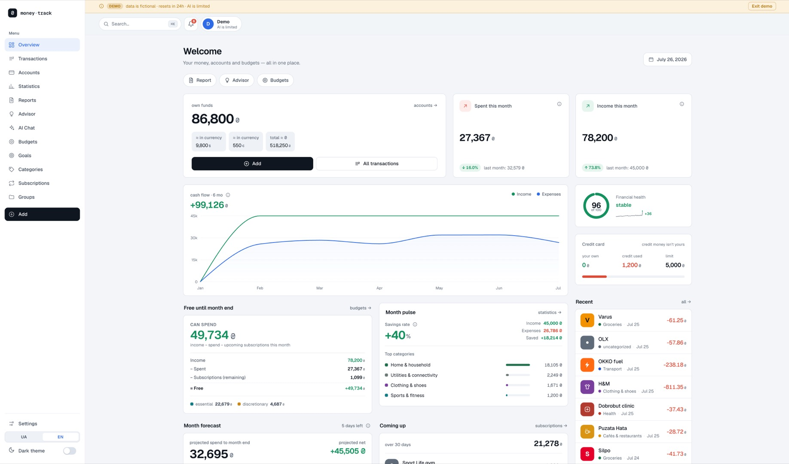
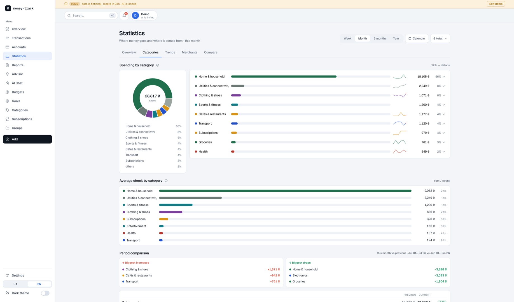
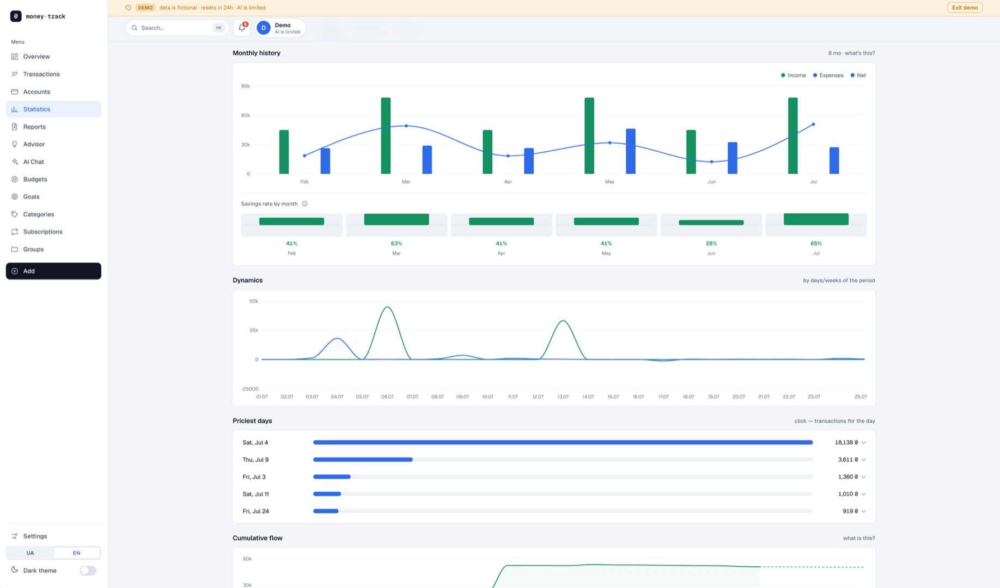
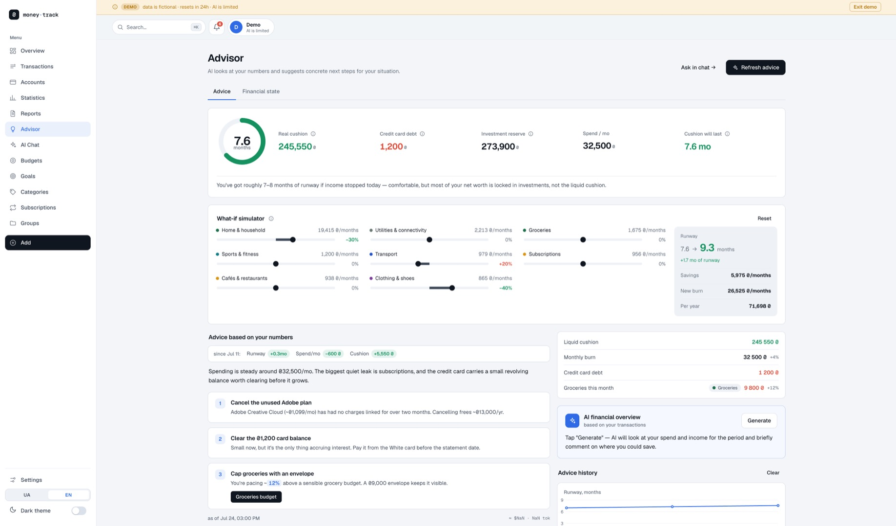
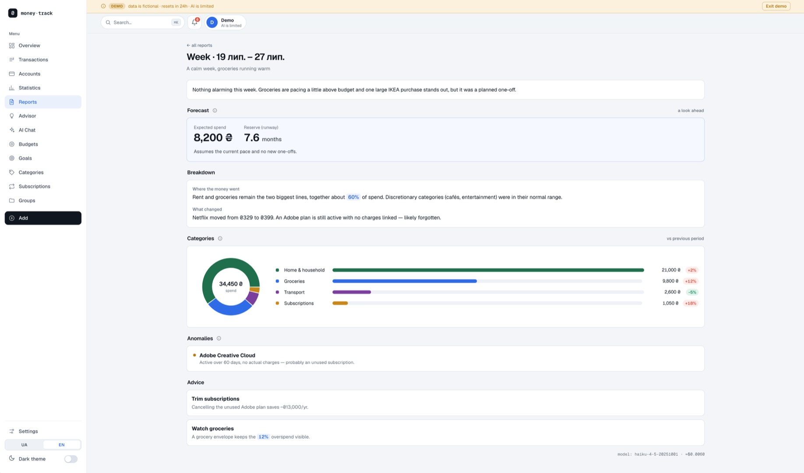
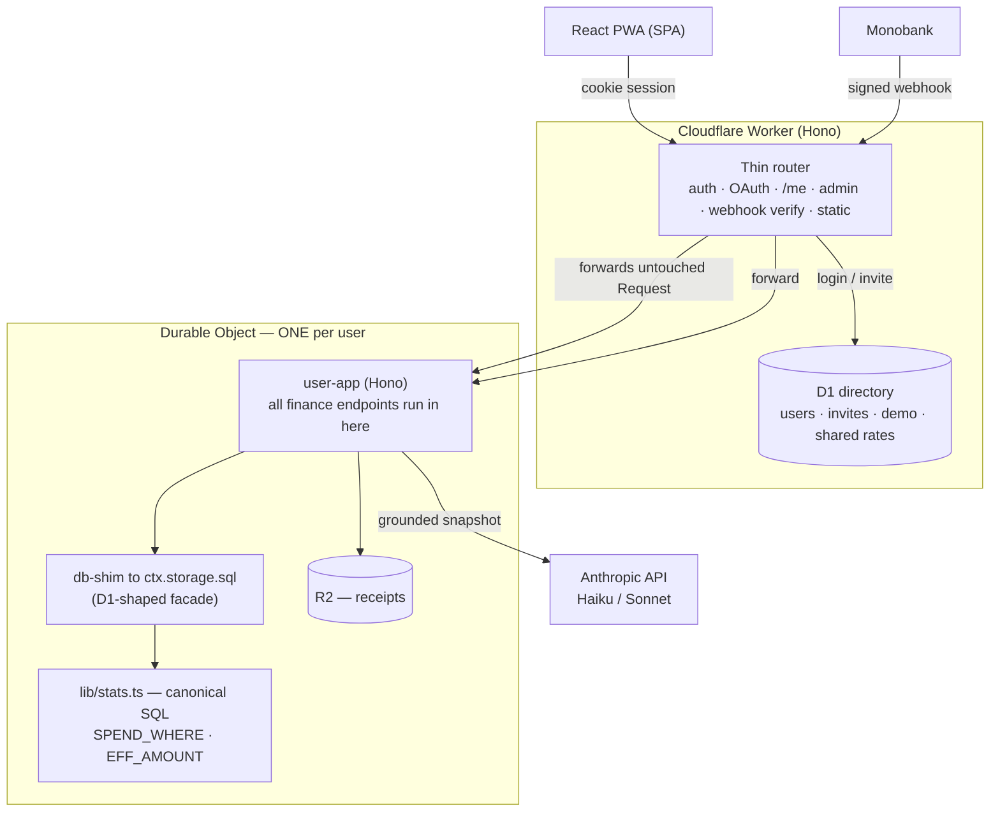

# Money Track

A personal finance tracker built as a **portfolio project** — with heavy use of AI, and a lot of
deliberate effort spent making sure the AI never got to lie about the numbers.

It connects to a Ukrainian bank (Monobank) or a CSV export, categorizes every transaction with a
deterministic-first pipeline, and layers an AI financial advisor on top that reasons over the
**same canonical numbers** the UI shows — never its own.

> **Try it:** [`/demo`](https://money-track.vitaliy-50a.workers.dev/demo) — spins up a private,
> throwaway sandbox seeded with ~6 months of realistic data. No sign-up, resets in 24 hours.



<table>
<tr>
<td width="50%"></td>
<td width="50%"></td>
</tr>
<tr>
<td></td>
<td></td>
</tr>
</table>

<sup>Screenshots are from the live demo — the same seeded dataset anyone gets at `/demo`.</sup>

---

## What it does

- **Bank sync** — Monobank webhook + ~90-day backfill, or a CSV statement import. A `BankProvider`
  abstraction normalizes sign/currency/minor-units in exactly one place per bank.
- **Deterministic categorization** (AI is the *last* resort): learned merchant alias → active
  subscription match → merchant consensus → MCC/text rules → AI enrichment.
- **Analytics** that are correct by construction: multi-currency roll-up to ₴, sub-category
  roll-up, splits, refunds, reimbursements, transfers between your own accounts, cash reclassified
  by real category — all funneled through one canonical SQL layer.
- **AI advisor & chat** with tool-use (queries the full transaction history), weekly/monthly
  reports, a proactive notification feed, and a fact layer ("the metro fare went 8 → 30 ₴") that
  can adjust the forecast — but only after you confirm it.
- **Budgets, goals, event/trip budgets, net-worth history, a financial-health index**, subscription
  price-drift detection, a command palette (⌘K), and a bilingual UI (English / Ukrainian).
- **Multi-user & isolated** — every user's entire database lives in their own Durable Object.
- Installable **PWA**.

---

## Architecture

The whole app is one Cloudflare Worker. The interesting decision is **isolation via a Durable
Object per user** instead of `user_id` columns.



**Why a Durable Object per user (not `WHERE user_id`)?** Row-level multi-tenancy would mean adding
a filter to every one of dozens of canonical queries — and one forgotten filter leaks another
person's money. With a DO per user the isolation is *physical*: there is no `user_id` to forget,
and `lib/stats.ts` stays byte-for-byte the same as the single-user version.

**Why does it stay fast?** The naive version proxies a `db` object from the Worker into the DO over
RPC — one network round-trip per `prepare().all()`, dozens per analytics page. Instead the Worker
**forwards the untouched Request into the DO** and the handlers run *next to* the data, with
`env.DB` pointing at a local synchronous SQLite facade. One hop per request.

**The demo** is the same DO with a different lifecycle: `GET /demo` mints an ephemeral
`demo:<random>` object, seeds it from a committed snapshot, and arms a 24-hour self-destruct alarm
(with a daily cron sweep as a backstop). Its AI runs on a dedicated key behind per-session and
global daily caps, forced to the cheapest model.

---

## Built with AI — and kept honest

This is the part I'd actually want reviewed. The project was built with heavy AI assistance, and the
central engineering problem was not *generating* code — it was **stopping the AI (and myself) from
quietly making the numbers wrong.** The rule throughout: *a check beats an instruction.*

- **One source of truth for every number.** All money math lives in `worker/lib/finance/stats.ts`
  (`SPEND_WHERE`, `EFF_AMOUNT`, the ₴ roll-up, importance, recurring vs one-off). The AI advisor and
  chat consume the *same* `collectFinanceSnapshot()` the UI does — so the chat's figures always
  equal the dashboard's. The most expensive bugs in this project all came from a *second* place
  deciding what a number meant.

- **`numbersAreGrounded()`** — the notification AI is told to only restate pre-computed figures. It
  still, on real data, invented "8 subscriptions = 3354 ₴/mo … that's 3600+ ₴/mo." So a deterministic
  filter now rejects any observation whose numbers can't be found in the snapshot payload. An
  instruction to a model is not a guarantee; the guarantee is the check.

- **A SQL lint in CI.** SQL is just a string — `tsc` can't see into it. When a refactor left five
  queries referencing a join alias they no longer had, the whole Statistics page silently emptied.
  `scripts/check-stats-sql.mjs` now fails the build if a query uses a canonical helper without the
  join that defines its aliases.

- **A fact-confirmation gate.** The AI can *propose* that a real-world change should move your
  forecast, but the number it proposes is derived deterministically from your history, and it only
  affects the math after **you** confirm it — never silently.

- **Typed i18n keys.** A translation key missing from the source dictionary fails `tsc`, not the
  user's screen.

- **Working documents, not artifacts.** `CLAUDE.md` (durable reference + invariants), `DESIGN.md`
  (design system + decision log), `ROADMAP.md` (the live queue) and `HISTORY.md` (closed-phase design notes) are how the work was actually planned and kept coherent across sessions.

---

## Tech stack

| Area | Choice |
|---|---|
| Runtime | Cloudflare **Workers** + **Durable Objects** (SQLite) + **D1** + **R2** |
| Server | **Hono**, TypeScript |
| Frontend | **React 19**, Redux Toolkit (RTK Query), React Router 7, **Recharts**, Vite, `vite-plugin-pwa` |
| AI | **Anthropic** — hybrid **Haiku 4.5** (bulk: enrich/OCR/parse/insight) / **Sonnet** (user-facing: advisor/reports/chat) |
| Bank | Monobank (webhook + backfill), CSV import; provider abstraction |
| Auth | Google OAuth (invite-only), stateless HMAC-signed session cookie |
| i18n | Custom ~40-line `t()` with compile-checked keys; English / Ukrainian |

Money is stored as **integer minor units** (копійки) everywhere; division by 100 happens only at
display.

---

## Running locally

```bash
npm install
cp .dev.vars.example .dev.vars     # fill in secrets (see the file's comments)

# Apply migrations to the local D1 databases
npm run db:migrate:local
npm run db:dir:migrate:local

npm run dev                        # Vite dev server
```

> Use `npm run dev` (Vite), **not** `wrangler dev` — the latter reads a stale redirected config and
> won't see new bindings.

**Green bar before "done":**

```bash
npm run check      # tsc (app + worker) + SQL lint + i18n parity + migration-embed freshness
npm run build      # production build
```

**Deploy:** `npm run deploy` (needs `wrangler login`, secrets set as Worker secrets, and migrations
applied to remote D1). See `CLAUDE.md` §Ops for the exact checklist.

---

## Project layout

```
worker/
  index.ts            Worker entry: routing, auth, cron fan-out, demo bootstrap
  user-app.ts         Hono app that runs INSIDE each user's Durable Object
  do/UserDO.ts        the per-user Durable Object (+ demo seeding, backfill alarm)
  lib/stats.ts        ⭐ canonical money/analytics SQL — the single source of truth
  lib/*               categorize, subscriptions, ai, advisor, report, notify, banks/, …
  demo/dataset.json   committed demo snapshot (generated by scripts/seed-demo.mjs)
src/                  React app (pages/, components/, store/, i18n/)
migrations/           D1 schema (finance) — 33 migrations
migrations-directory/ D1 schema (directory) — users/invites/demo/shared state
shared/               types + notification i18n shared by client and worker
scripts/              check-stats-sql, check-i18n, seed-demo, migration-embed generator
```

---

## License

MIT — see [`LICENSE`](LICENSE).

---

## Status

Feature-complete as a single-user app; the current phase turned it into an isolated multi-user
platform with a public demo and an English UI, live in production. Built as a
portfolio piece — not a commercial product.
